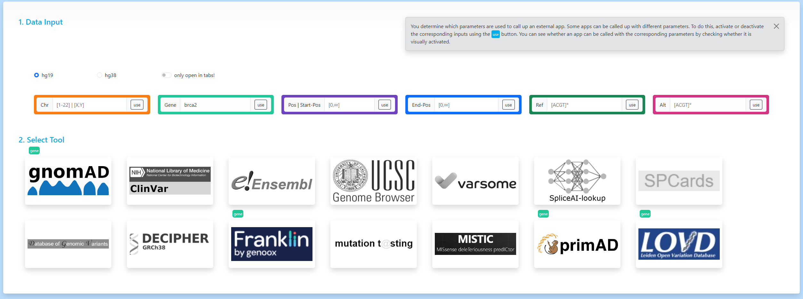

# VICA
App Collection 4 Genomic Variant Interpretation
## Introduction
Nowadays, there are a large number of in-silico tools that deal with the analysis and assessment of genomic variants and regions.
Modern web technologies make it possible to make the information resulting from these tools available in online databases in a structured manner and with search functions.
The current app, called VICA, combines access to such online databases within a user interface (UI).
Based on a simple set of parameters [chromosome, gene, start position, end position, ref, alt], VICA independently determines whether the set of parameters is sufficient to retrieve information from a corresponding online database.

##
To all programmers who always do everything better: I am aware that nobody uses jQuery anymore and that there are better frameworks for interactive front-end design. And yes, the dirty vanilla JavaScript could certainly have been solved better. But it is enough to implement this simple idea.
## Links
logos from following web page are used:
* https://gnomad.broadinstitute.org/
* https://www.ncbi.nlm.nih.gov/clinvar/
* policy: https://grch37.ensembl.org/info/about/legal/index.html
* https://genome.ucsc.edu/
* https://varsome.com/
* https://spliceailookup.broadinstitute.org/
* http://www.genemed.tech/spcards/analysis
* http://dgv.tcag.ca/dgv/app/home
* https://www.deciphergenomics.org/
* https://franklin.genoox.com/clinical-db/home
* https://www.genecascade.org/MutationTaster2021/
* https://lbgi.fr/mistic/
* https://primad.basespace.illumina.com/
* https://www.lovd.nl/
