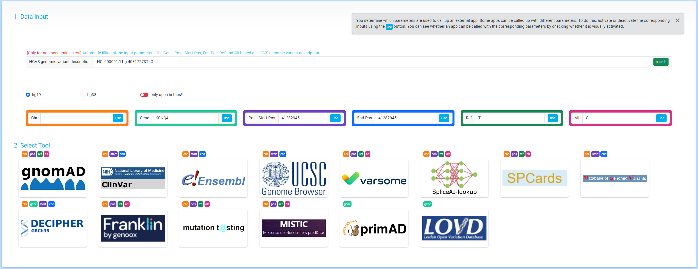

# VICA
App Collection 4 Genomic Variant Interpretation

##
To all programmers who always do everything better: I am aware that nobody uses jQuery anymore and that there are better frameworks for interactive front-end design. And yes, the dirty vanilla JavaScript could certainly have been solved better. But it is enough to implement this simple idea.

